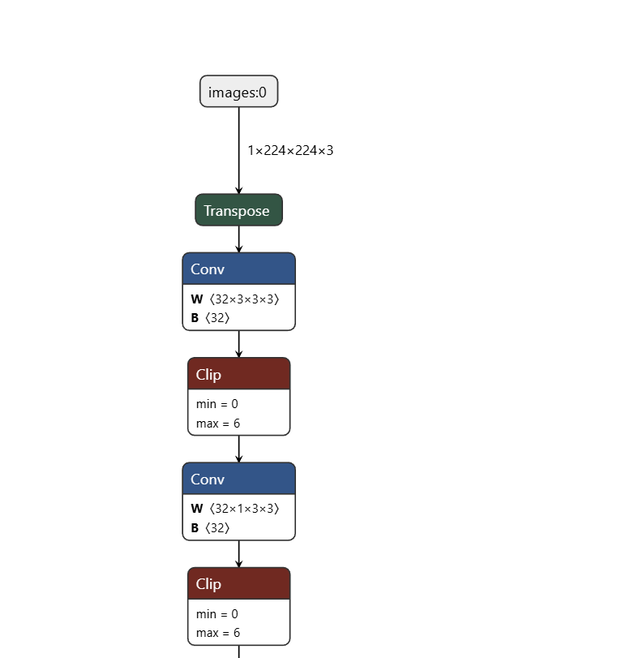
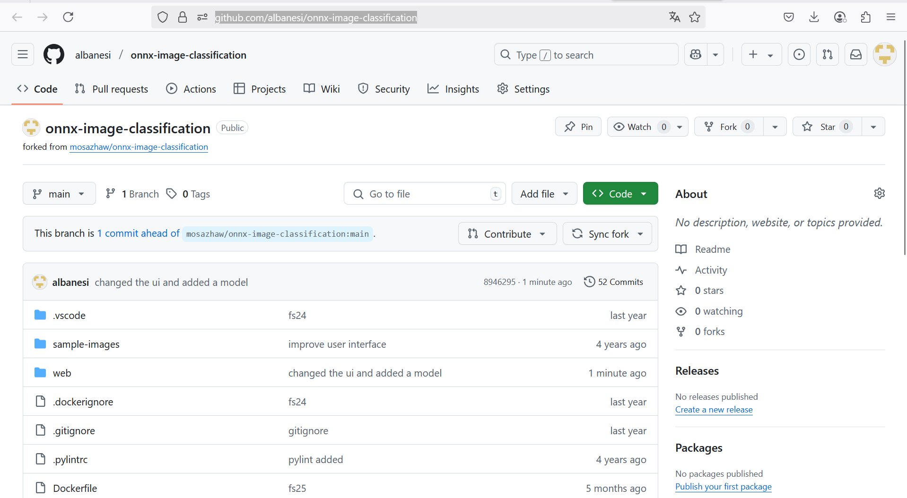
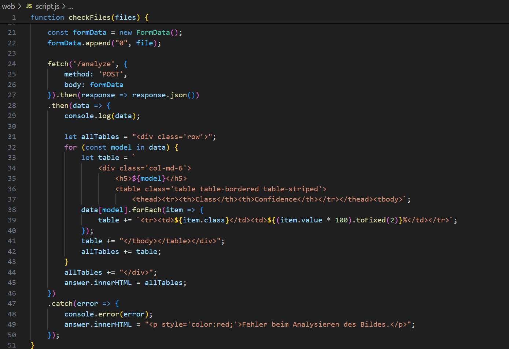
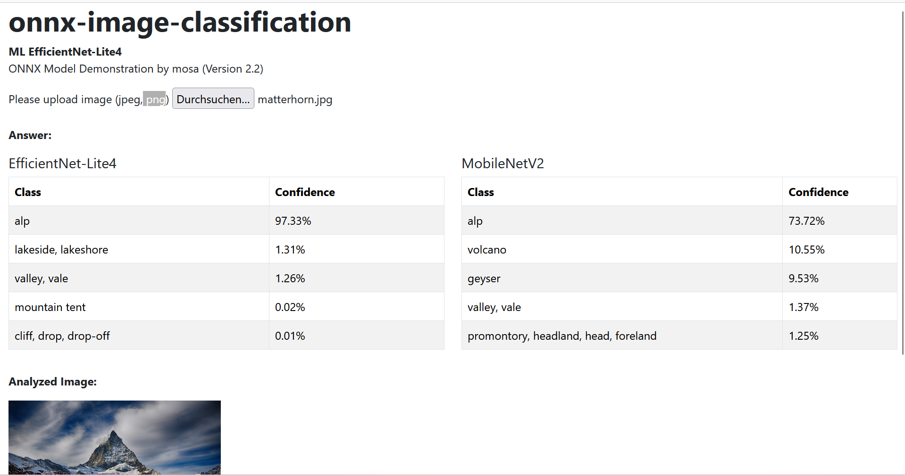
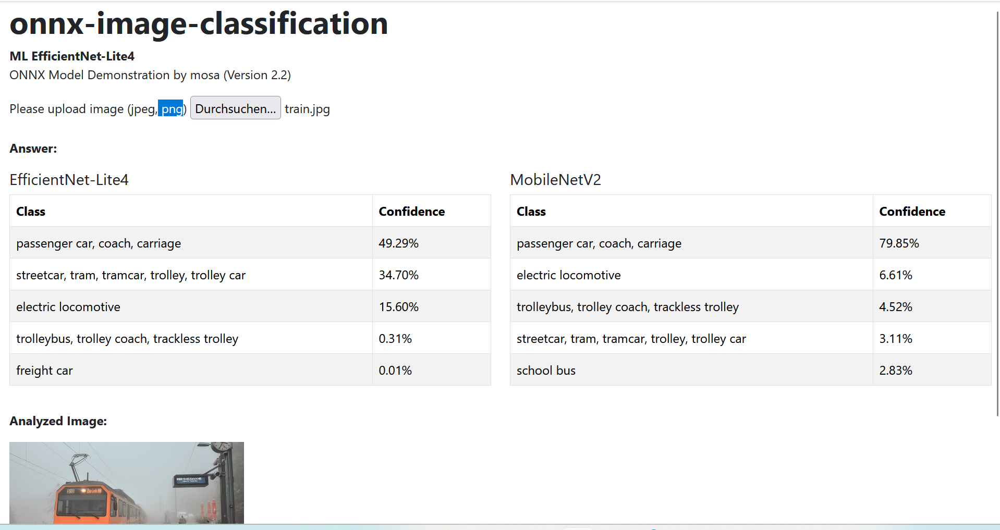

# Lernjournal 3 ONNX

## Übersicht

| Abschnitt                              | Inhalt                                         |
|----------------------------------------|------------------------------------------------|
| ONNX Modell für Analyse (Netron)       | [https://netron.app](https://netron.app) → EfficientNet-Lite4 |
| onnx-image-classification Fork (GitHub) |https://github.com/albanesi/onnx-image-classification              |

---

## Dokumentation ONNX Analyse

✅ **Modell:** EfficientNet-Lite4 (ONNX Model Zoo)  
📎 URL: https://github.com/onnx/models/tree/main/validated/vision/classification/efficientnet-lite4

**Analyse mit Netron:**
- Input-Shape: `[1, 224, 224, 3]`
- Architektur: Tiefes CNN mit Conv → BatchNorm → ReLU → Pooling
- Final Layer: GlobalAveragePool → Gemm → Softmax
- Besonderheit: ca. 438 Knoten, typischer EfficientNet-Block

<!-- 📷 Screenshot aus Netron (Graphstruktur, Input) -->

---

## Dokumentation onnx-image-classification

### 📁 Fork erstellt

Fork von `onnx-image-classification` erstellt und erweitert.  
➡️ [Link zu deinem GitHub-Fork einfügen]

<!-- 📷 Screenshot vom GitHub-Fork -->

---

### 🔧 App-Erweiterung

- Zwei Modelle gleichzeitig geladen: `EfficientNet-Lite4` und `MobileNetV2`
- Vergleich der Top-5-Ergebnisse direkt im Backend
- Softmax wird **nur für MobileNetV2** angewendet (EfficientNet hat es eingebaut)

<!-- 📷 Screenshot vom app.py -->

---

### 💻 Web UI

- Responsive Bootstrap-Layout
- Zwei Spalten: je eine Tabelle pro Modell
- Bildvorschau im Browser

<!-- 📷 Screenshot vom UI -->

---

### ⚙️ Frontend JavaScript

- Antwort aus `/analyze` dynamisch ausgewertet
- Modelle werden in separaten Spalten angezeigt
- Prozentwerte formatiert mit `.toFixed(2)`

<!-- 📷 Screenshot vom JS -->

---

### ✅ Test-Workflow

- Drei Beispielbilder getestet: Matterhorn, Zug, Auto
- Ergebnisse zeigten unterschiedliche Stärken der Modelle

<!-- 📷 Screenshots der Modellantworten -->

---

