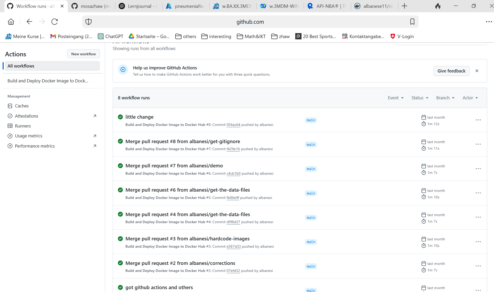
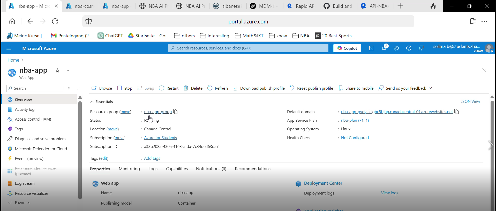
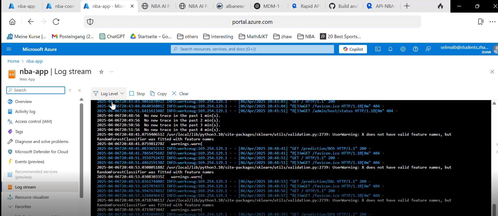
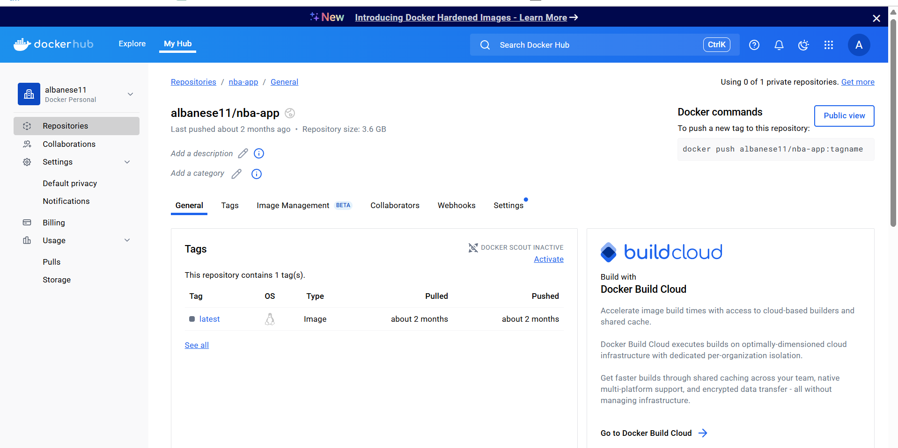
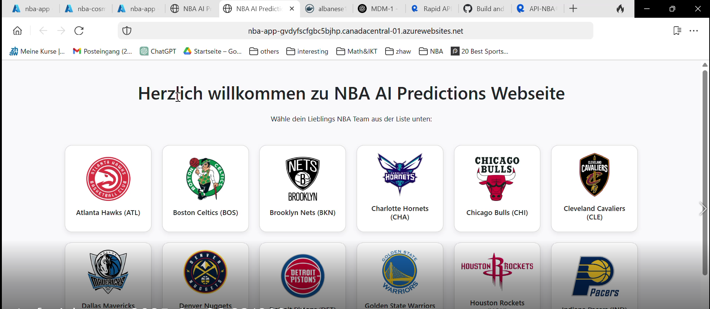
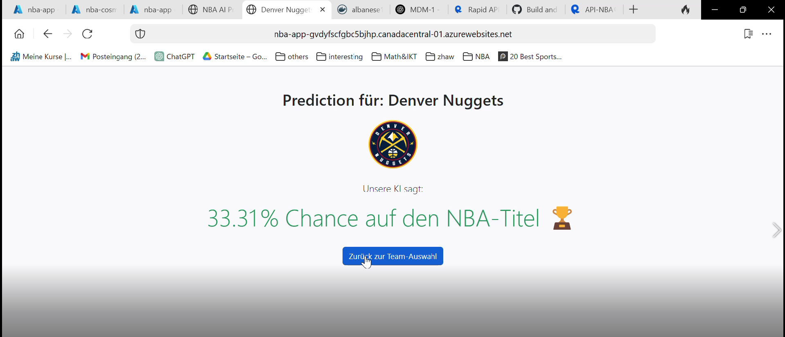

# Projekt 1 Python

## Übersicht

| | Bitte ausfüllen |
| -------- | ------- |
| Variante | Eigenes Projekt |
| Datenherkunft | Die Daten kommen aus einer API. Die API heisst API-NBA und war kostenpflichtig. Ich konnte dank Rapid-Hub auf sie zugreifen. Die Daten wurden aus dieser API geholt, da es keine guten Webseiten gab aus denen man die Daten hätte scrapen können |
| Datenherkunft | https://rapidapi.com/api-sports/api/api-nba/playground/apiendpoint_5b1e1e9a-1497-45b5-b9fb-50f9212d4421 |
| ML-Algorithmus | Random Forest |
| Repo URL | https://github.com/albanesi/NBA-KI |

# 🏆 Dokumentation – NBA Champion Prediction App


---

## 🏀 Data Gathering

Die zugrunde liegenden Spieldaten und Teamstatistiken werden automatisiert über die NBA API bezogen. Die Applikation fokussiert sich auf teambasierte saisonale Leistungsmetriken, insbesondere:

- Anzahl Siege und Niederlagen  
- Gewinnquote (`winPct`)  
- Platzierung in Conference und Division  

Die Daten werden kontinuierlich in eine MongoDB-Datenbank (`LN1`, Collection: `NBA-TrainingData`) gespeichert. Die aktuelle Saison (2024) wird bewusst ausgenommen, um ein echtes Inferenzszenario zu simulieren.

---

## 🎯 Training

Für das Modelltraining wird ein strukturierter Machine-Learning-Workflow verwendet:

- **Features**: `wins`, `losses`, `winPct`, `conferenceRank`, `divisionRank`
- **Zielvariable**: `champion` (binär: 1 = Champion, 0 = kein Champion)

Nach einem `train_test_split` mit Stratifikation erfolgt das Training eines **RandomForestClassifier** mit:

- 100 Bäumen  
- `class_weight="balanced"`  
- Reproduzierbarem Ergebnis durch `random_state=42`  

Evaluation mittels `classification_report`, Speicherung als:

```
✅ Modell gespeichert als nba_champion_model.pkl
```

---

## ⚙️ ModelOps Automation

Die Build- und Deploy-Automatisierung erfolgt über **GitHub Actions**. Bei jedem Push auf `main` wird ein Workflow ausgelöst, der:

- Das Repository clont  
- Eine Docker-Build-Umgebung aufsetzt  
- Sich bei Docker Hub einloggt  
- Das Image `albanese11/nba-app:latest` erstellt und pushed

### CI/CD Screenshot:



---

## 🚀 Deployment (Azure Web App)

Die Anwendung wird als Docker-Container über **Azure App Service** bereitgestellt.  
Sie läuft in der Region **Canada Central** auf Linux-Basis.



---

## 📊 Azure Log Stream

Das Azure Log Stream Feature zeigt Live-Logs der Web App.  
Es dokumentiert HTTP-Requests an die Prediction-Endpunkte sowie mögliche Modell-Warnungen (z. B. Scikit-Learn Feature-Warnings).



---

## 🗄️ MongoDB (Azure Cosmos DB)

Als Datenbank dient eine Mongo-kompatible Azure Cosmos DB (vCore).  
Der Zugriff erfolgt über sichere Verbindungsstrings mit TLS und SCRAM-Authentifizierung.  

Die Datenbank hält sämtliche Saisondaten für Training und Inferenz bereit.


---

## 🐳 Docker Hub – Container Registry

Das finale Image wird nach jedem erfolgreichen GitHub Actions Build in folgendes öffentliches Repository gepusht:

- **Docker Hub**: `albanese11/nba-app`
- **Tag**: `latest`



---

## 🌐 Benutzeroberfläche

Die Landing Page ermöglicht die Auswahl eines NBA-Teams. Die Logos sind als Grid dargestellt. Der Klick auf ein Logo löst die Modellvorhersage im Backend aus.



---

## 📈 Prediction Page

Nach Auswahl eines Teams wird das Logo eingeblendet sowie die geschätzte Wahrscheinlichkeit angezeigt, dass das Team NBA-Champion wird. Die Anzeige ist zentriert und mobilfreundlich.



---

## 🎨 UX und Designüberlegungen

Die Ergebnisdarstellung wurde bewusst minimalistisch gestaltet.  

### Merkmale:

- **Zentrierte Darstellung** von Teamname, Logo und Wahrscheinlichkeit
- **Grüne Prozentanzeige** für klare visuelle Wirkung
- **Trophäen-Emoji** als semantisches Icon
- **Zurück-Button** für Wiederverwendung ohne Reload

Ziel war es, eine intuitive, responsive Nutzeroberfläche zu gestalten – optimiert für Desktop und mobile Geräte.

---

## 🧩 Deployment: Azure & Docker Befehle

Für das Deployment wurde ein vollständiger Docker-Workflow verwendet. Das folgende Kommando-Set dokumentiert die wichtigsten Schritte zur Bereitstellung auf Azure App Service mit Docker Hub:

### 🧱 1. Docker-Image lokal bauen (optional)

```bash
docker build -t nba-app .
```

### 🔐 2. Anmeldung bei Docker Hub

```bash
docker login
```

### 🏷️ 3. Docker-Image taggen

```bash
docker tag nba-app albanese11/nba-app:latest
```

### ☁️ 4. Image zu Docker Hub pushen

```bash
docker push albanese11/nba-app:latest
```

> **Hinweis**: In der finalen Version erfolgt dieser Schritt automatisiert über GitHub Actions.

### 🌍 5. Azure App Service erstellen (Linux-Container)

```bash
az webapp create   --resource-group nba-app_group   --plan nba-plan   --name nba-app   --deployment-container-image-name albanese11/nba-app:latest
```

### 🔄 6. Manuelles Aktualisieren des Images (optional)

```bash
az webapp config container set   --name nba-app   --resource-group nba-app_group   --docker-custom-image-name albanese11/nba-app:latest
```

---

## ✅ Fazit

Diese App zeigt, wie sich Data Science, API-Integration, maschinelles Lernen und moderne Cloud-Technologien zu einem vollständigen Produkt vereinen lassen. Die Kombination aus Echtzeitdaten, trainiertem Modell, automatisiertem Deployment und klarer Benutzerführung macht die Anwendung sowohl technisch robust als auch nutzerfreundlich.
