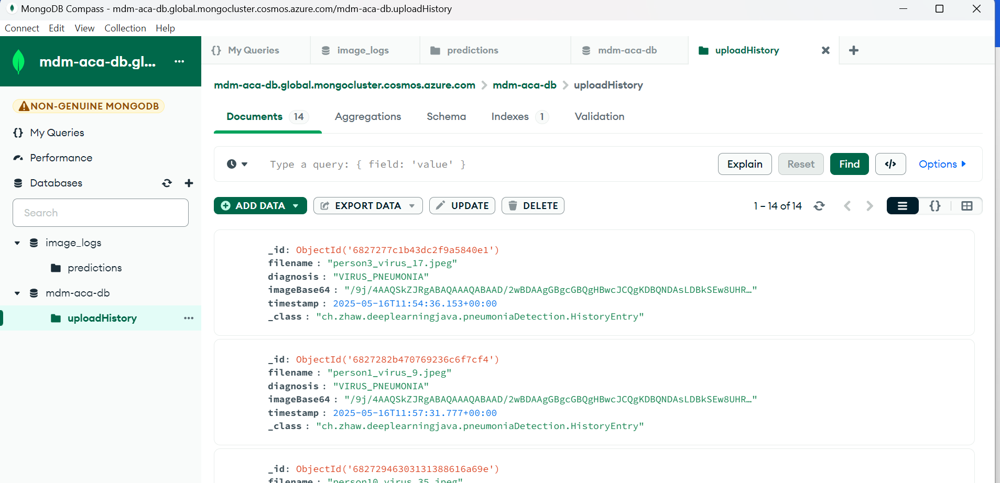
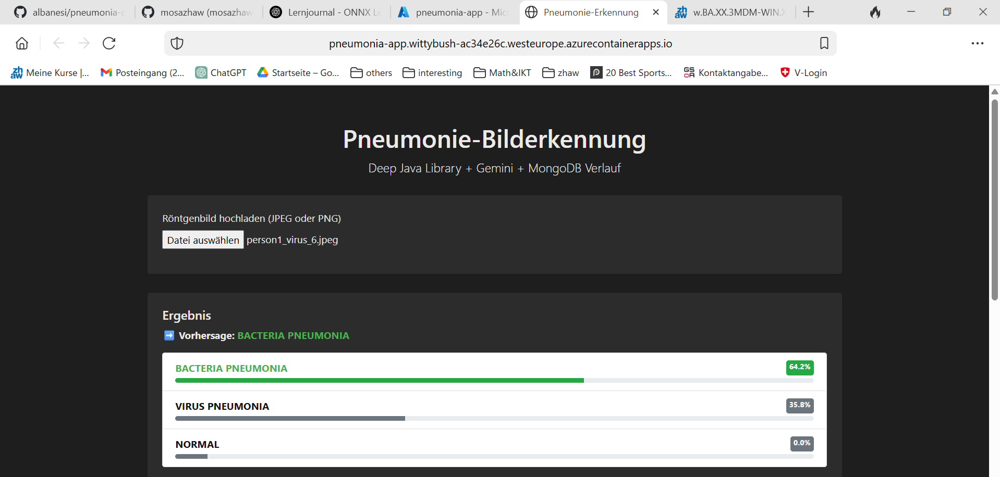
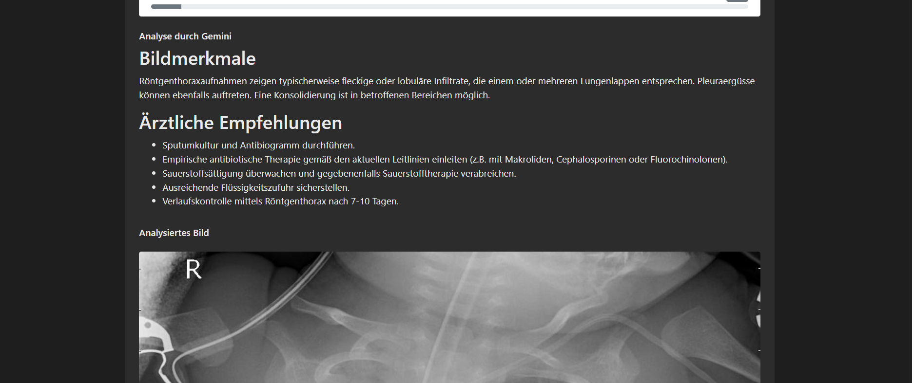
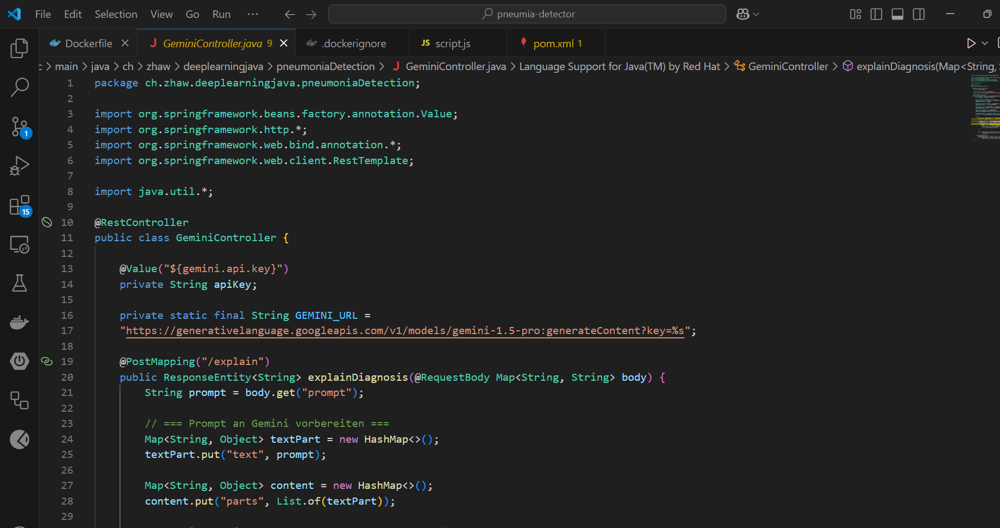

# Projekt 2 Java

## Übersicht

|                                 | Bitte ausfüllen                                                                 |
|---------------------------------|----------------------------------------------------------------------------------|
| Variante                        | Vorhandener Datensatz                                                           |
| Datensatz (wenn selbstgewählt) | Die Daten sind im JPEG-Format. Es handelt sich ausschliesslich um Röntgenbilder von Lungen. |
| Datensatz (wenn selbstgewählt) | https://www.kaggle.com/datasets/paultimothymooney/chest-xray-pneumonia         |
| Modell (wenn selbstgewählt)    | Eigenständig mit DJL implementiert                                              |
| ML-Algorithmus                 | Convolutional Neural Network (CNN) mit Softmax-Ausgang                          |
| Repo URL                        | https://github.com/albanesi/pneumonia-classifier                                |

---

## Dokumentation

### 📂 Daten

Der Datensatz besteht aus klassifizierten Röntgenbildern von Lungen im JPEG-Format, unterteilt in drei Teilmengen:
- `train/`: Trainingsbilder
- `val/`: Validierungsbilder
- `test/`: Testbilder

Die Bilder stammen aus dem öffentlich verfügbaren Kaggle-Datensatz „Chest X-Ray Images (Pneumonia)“ und sind in zwei Klassen unterteilt: `NORMAL` und `PNEUMONIA`.  

Für das Training wird der DJL-Dataset-Typ `ImageFolder` verwendet, ergänzt durch zwei Bildtransformationen:
- `Resize` auf die Modellinputgrösse
- `ToTensor` zur Normalisierung

---

### 🧠 Training

Das Modelltraining erfolgt mit dem Deep Java Library (DJL) Framework. Der Ablauf umfasst:

1. Laden und Vorverarbeiten der Trainings-, Validierungs- und Testdaten
2. Initialisierung des Modells inklusive Konfiguration von:
   - Verlustfunktion: `softmaxCrossEntropyLoss`
   - Evaluator: `Accuracy`
   - Logging Listener
3. Training über **3 Epochen** mit `EasyTrain.fit`
4. Speicherung von Modellparametern, Metadaten und Klassenlabels

Das Modell wird über den `Trainer` evaluiert. Zusätzlich erfolgt eine manuelle Evaluation auf dem Testset. Die Resultate umfassen:
- Validierungsgenauigkeit (`Accuracy`)
- Verlust (`Loss`)
- Testgenauigkeit (separat berechnet über echte Testdaten)

Am Ende wird das Modell als DJL-kompatibles Modellobjekt im Verzeichnis `models/` abgespeichert.

---

### 📤 Inference / Serving

Die Inferenz erfolgt über den DJL-Predictor:

- Das trainierte Modell wird geladen
- Ein Bild wird durch die zuvor gespeicherten Transformationen normalisiert
- Die Vorhersage erfolgt als `Classifications`-Objekt

Dabei gibt `predict(image)` die wahrscheinlichste Klasse zurück (`NORMAL`, `BACTERIAL_PNEUMONIA` oder `VIRUS_PNEUMONIA`).  
Die Inferenzlogik wurde erfolgreich getestet und auf mehreren Testbildern validiert.

---

### 🗄️ Datenbank (MongoDB)

Die Applikation speichert Vorhersagen zusammen mit den hochgeladenen Bildern in einer Azure Cosmos DB (MongoDB vCore-kompatibel).  

Die Collection `uploadHistory` enthält für jeden Klassifikationsvorgang:

- **filename**: Name der hochgeladenen Bilddatei  
- **diagnosis**: Vorhersage der KI (`BACTERIAL_PNEUMONIA`, `VIRUS_PNEUMONIA`, `NORMAL`)  
- **imageBase64**: Das Originalbild in Base64-kodierter Form  
- **timestamp**: Zeitstempel des Uploads  
- **_class**: Java-Klassenzuordnung für das Mapping  

Dies ermöglicht eine lückenlose Nachverfolgbarkeit und die Option, einen **Klassifikationsverlauf pro Benutzer** anzuzeigen.



---

### 🔍 Funktion der App

Die Web-App erlaubt es Benutzer:innen, ein eigenes Röntgenbild einer Lunge hochzuladen. Die Applikation verwendet ein trainiertes neuronales Netzwerk, um in Echtzeit zwischen drei Diagnoseklassen zu unterscheiden:

- **BACTERIAL_PNEUMONIA**
- **VIRUS_PNEUMONIA**
- **NORMAL** (gesunde Lunge)

Nach dem Upload:

1. Wird das Bild normalisiert und durch das Modell inferiert.
2. Die vorhergesagte Diagnose wird im UI zurückgegeben.
3. Die Information wird zusammen mit dem Bild und dem Ergebnis in der Datenbank gespeichert.

Ziel ist es, eine benutzerfreundliche und erweiterbare Plattform zur bildbasierten medizinischen Vorhersage bereitzustellen, die gleichzeitig als Lernbeispiel für Java-basierte KI-Projekte dient.

---

### ☁️ Deployment

Das Modell ist lokal und containerisiert einsetzbar. Für eine Web-basierte Integration kann ein REST-Backend (z. B. Spring Boot mit DJL) hinzugefügt werden.

Geplante Erweiterungen:
- Bereitstellung als REST-API mit Upload-Möglichkeit
- Integration in eine Azure Web App oder als Container Deployment (z. B. via Docker + GitHub Actions)
- Verlaufshistorie der Vorhersagen in MongoDB

---

### 🖼️ Benutzeroberfläche (Web UI)

Die Anwendung verfügt über ein intuitives Frontend, über das ein Röntgenbild (JPEG oder PNG) hochgeladen werden kann.  
Nach erfolgreicher Analyse durch das Modell wird das Ergebnis in Form eines farblich dargestellten Balkendiagramms angezeigt.

- Die höchste Wahrscheinlichkeit wird farblich hervorgehoben
- Alle drei möglichen Klassen (BACTERIAL, VIRUS, NORMAL) sind sichtbar
- Die Vorhersage ist visuell klar nachvollziehbar

Dies erleichtert nicht nur das Verständnis der Klassifikation, sondern macht die KI-Ausgabe auch für medizinisch nicht geschulte Benutzer:innen zugänglich.



---

### 🤖 Gemini-Analyse & visuelle Befundung

Nach erfolgreicher Inferenz zeigt die App unterhalb der Wahrscheinlichkeitsanzeige eine automatische Textausgabe, welche die typischen radiologischen Merkmale erklärt, z. B.:

> Röntgenthoraxaufnahmen zeigen typischerweise fleckige oder lobuläre Infiltrate, die einem oder mehreren Lungenlappen entsprechen. Pleuraergüsse können ebenfalls auftreten. Eine Konsolidierung ist in betroffenen Bereichen möglich.

Zusätzlich werden ärztliche Handlungsempfehlungen eingeblendet, wie:

- Sputumkultur und Antibiogramm durchführen
- Antibiotische Therapie nach Leitlinien beginnen
- Sauerstoffsättigung überwachen, ggf. Sauerstofftherapie einleiten
- Flüssigkeitszufuhr sichern
- Kontrollröntgen nach 7–10 Tagen

Diese Empfehlungen basieren auf den Resultaten der Analyse und sind hilfreich zur medizinischen Einordnung durch Fachpersonen.

### 🖼️ Angezeigtes Bild

Unterhalb der Empfehlungen wird das ursprünglich hochgeladene Bild nochmals dargestellt, um eine transparente Nachverfolgung der Befundung zu ermöglichen.




---

### 📊 Upload-Verlauf & ModelOps-Potenzial

Am Ende des Analyseprozesses bietet die Anwendung die Möglichkeit, über einen Button den **Upload-Verlauf** einzusehen.  
Dort werden alle bisher hochgeladenen Röntgenbilder inklusive:

- Dateiname
- Diagnose
- Zeitstempel
- Bildvorschau

in tabellarischer Form angezeigt.

Diese Daten werden aktuell in der MongoDB-Collection `uploadHistory` gespeichert und dienen als Grundlage für zukünftige **ModelOps-Prozesse**. Denkbare Erweiterungen:

- Retraining basierend auf neuen Eingabebildern
- Fehleranalyse und Rückmeldung an das Modell
- Versionsvergleich bei neu trainierten Modellen

Der Verlauf stellt somit eine erste Stufe dar, um die KI-Anwendung nicht nur als einmalige Vorhersagekomponente, sondern als **lebendiges, lernfähiges System** aufzubauen.


---

### ☁️ Azure Ressourcengruppe & Infrastruktur

Die Anwendung wird vollständig containerisiert und cloudbasiert in Azure betrieben.  
In der Ressourcengruppe `pneumeniaRessource` wurden folgende Komponenten eingerichtet:

- **pneuminiadetector**: Container Registry zum Hosten des Docker-Images
- **pneumonia-app**: Container App (läuft als Webservice)
- **pneumonia-env**: Container App Environment (für Netzwerke & Skalierung)
- **Log Analytics Workspaces**: Zur Protokollierung und Diagnose


### ⚙️ Verwendete Azure CLI-Befehle

Die nachfolgenden Befehle zeigen, wie die Infrastruktur eingerichtet wurde:

```bash
# 1. Ressourcengruppe erstellen
az group create   --name pneumeniaRessource   --location westeurope

# 2. Container Registry anlegen
az acr create   --resource-group pneumeniaRessource   --name pneuminiadetector   --sku Basic

# 3. Container App Environment erstellen
az containerapp env create   --name pneumonia-env   --resource-group pneumeniaRessource   --location westeurope

# 4. Container App bereitstellen
az containerapp create   --name pneumonia-app   --resource-group pneumeniaRessource   --environment pneumonia-env   --image pneuminiadetector.azurecr.io/pneumonia:latest   --target-port 8080   --ingress external   --registry-login-server pneuminiadetector.azurecr.io   --registry-username <USERNAME>   --registry-password <PASSWORD>
```

> Die Zugangsdaten zur Container Registry werden sicher über GitHub Actions Secrets oder Azure Key Vault hinterlegt.  
> Zusätzlich wurden mehrere **Log Analytics Workspaces** erstellt, um Monitoring und Diagnose zu ermöglichen.


---

### 🐳 Docker Hub – Container Registry

Das Docker-Image der Pneumonie-App wird in einem öffentlichen Repository auf Docker Hub gespeichert und versioniert.

- **Repository**: `albanese11/pneumonia-app`
- **Tag**: `latest`
- **Grösse**: ca. 458 MB
- **Push-Zeitpunkt**: zuletzt vor 9 Tagen
- **Zugriff**: öffentlich (Public View aktivierbar)

Das Image wird nach erfolgreichem Build (lokal oder via GitHub Actions) mit folgendem Befehl gepusht:

```bash
docker push albanese11/pneumonia-app:latest
```

Die Bereitstellung über Docker Hub ermöglicht eine einfache Wiederverwendung in der Azure-Umgebung und unterstützt Continuous Deployment.


